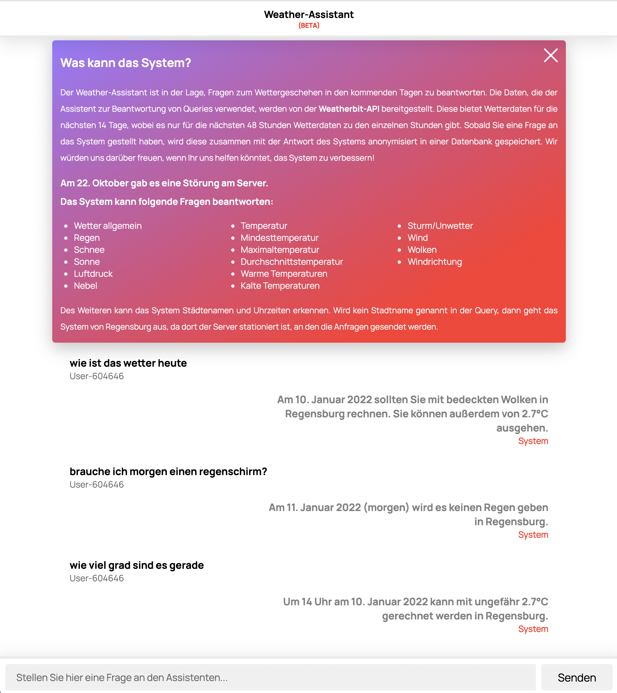

# Weather Assistant

## About
Weather Assistant is a ChatBot that allows users to request weather data. The questions have to be asked in German. Very specific questions about the weather can be answered as well as simple questions like when it will rain again. The bot was implemented as part of the advanced Natural Language Processing course.  Methods used in the two semesters in the Natural Language Processing courses should be applied in practice.

## Gallery

 

  

 

## Programming Languages
* Python
* Javascript

## Used Technologies

* Regular Expressions
* geocoder
* geopy
* pywheatherbit
* xmltodict
* Lark
* Scikit-Learn
* Flask
* Spacy
* nltk
* pandas
* Postman